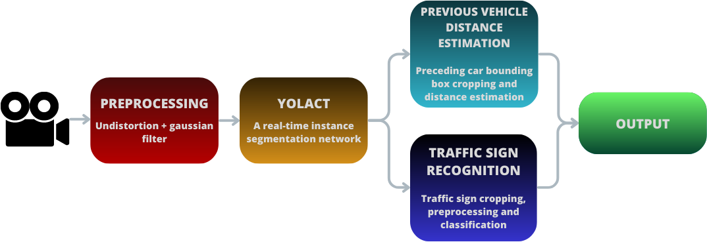
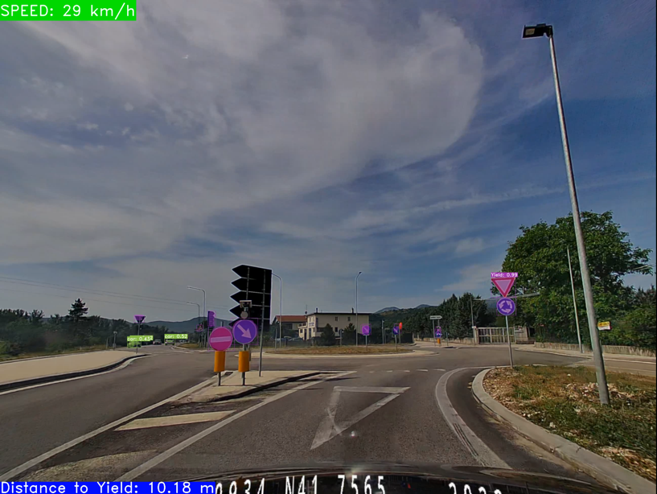
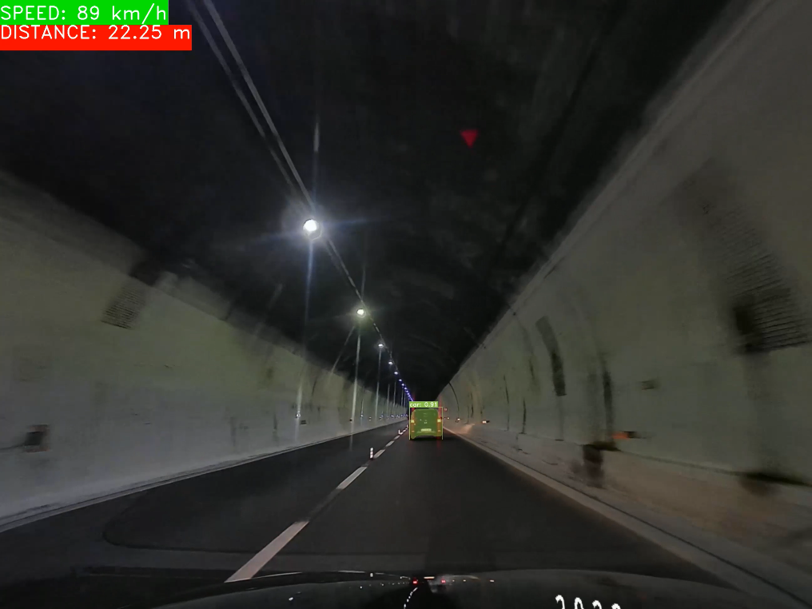

# A deep approach for an adaptive cruise control system

This is a computer vision project for the development of an ADAS system of an adaptive cruise control system.
Below it is possible to see some results of our pipeline

<p style="text-align:center">
  
  
</p>

### Installation

It is strongly suggested to create a virtual enviroment before installing. After venv creation, you can install all the
requirements by launching on terminal this command:

    pip install -r requirements.txt

### Test

You can follow these command to execute the complete network on an offline video (you can choose one of ours videos from 
the `./videos` folder):

- If you want to evaluate high_quality videos you must specify `--resolution=high_quality`

```
!python eval.py --trained_model=weights/yolact_base_14_5565.pth --gtsrb=GTSRB/weights/STNgtsr_55_8736.pth --top_k=15 
--video_multiframe=4 --video=inputVideoPath.mp4:outputVideoPath.mp4 --distance=yes --resolution=high_quality
```

- If you want to evaluate low_quality videos you must specify `--resolution=low_quality`

```
!python eval.py --trained_model=weights/yolact_base_14_5565.pth --gtsrb=GTSRB/weights/STNgtsr_55_8736.pth --top_k=15 
--video_multiframe=4 --video=inputVideo.mp4:outputVideo.mp4 --distance=yes --resolution=low_quality
```

Some material for evaluation is available at
[this link](https://drive.google.com/drive/folders/1FZjOM-wsLqdbZlA8onLGCSWjptFIT9--?usp=drive_link).

If you want to test this pipeline in your own videos you have to adjust the camera parameters before launching the test.

### About the project

This project is based on YOLACT [[1]](#1), a real-time instance segmentation network. It is the starting 
point of our pipeline, which can be seen in the image below:

<p style="text-align:center">
  
</p>

more details are explained in [this](A_deep_approach_for_an_adaptive_cruise_control_system.pdf) pdf paper. Above are 
illustrated some other test examples:

<p style="text-align:center">
  
  
</p>

### Contributors

This project has been developed by:
- Alessandro Crescenzi - [contact](mailto:alessandorcrescenzi[at]outlook[dot]com)
- Giovanni Lambertini
- Alvaro Gjepali

### References

<a id="1">[1]</a> 
Daniel Bolya, Chong Zhou, Fanyi Xiao, and Yong Jae Lee. Yolact++: Better real-time instance segmentation. IEEE 
Transactions on Pattern Analysis and Machine Intelligence, 2020.